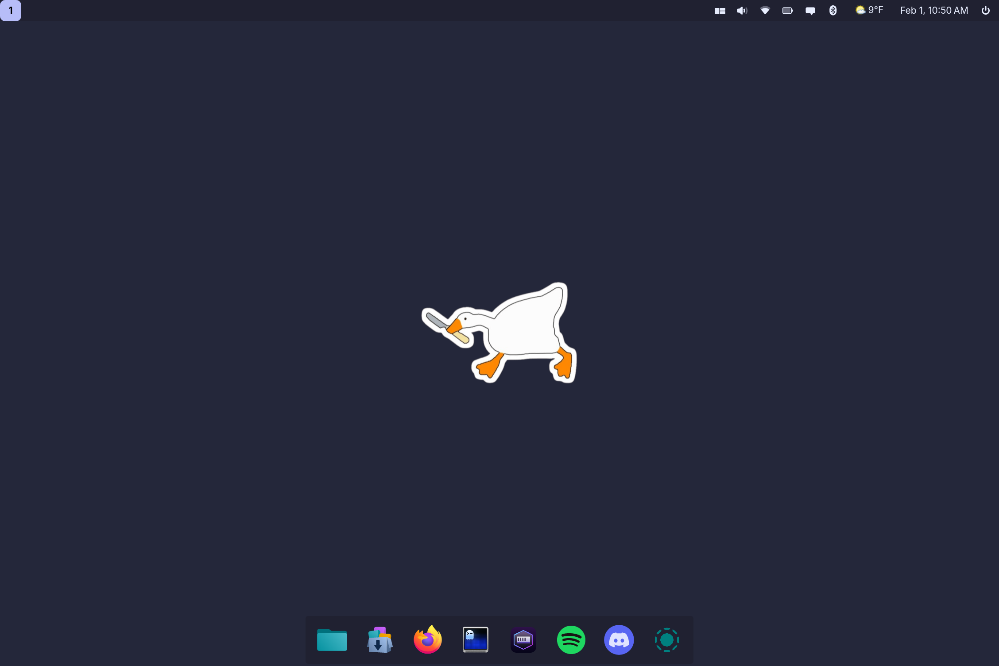

<div align="center">
  

  
  
  
</div>

## About

This is a custom Linux build designed around Fedora's [Atomic Desktops](https://fedoraproject.org/atomic-desktops/), as a community-driven adaptation of the [Universal Blue](https://universal-blue.org/) project. These systems are immutable by nature, which means users are actually gated from directly modifying the system, providing an incredibly secure form of interacting with the Linux platform.

This is the OS I use daily on a Framework 13 laptop. It features the [COSMIC desktop environment](https://system76.com/cosmic/), [Homebrew](https://brew.sh/) for package management, and anything you could want for containerized development. It's unopinionated by design, other than preferring [Ghostty](https://ghostty.org/) for the terminal, and [Catppuccin](https://catppuccin.com/) for the system theme.

If you'd like to use this yourself, please feel free! If you'd like to build your own, consult the [DIY](./docs/DIY.md) document.


## Installation

Verify the image signature with `cosign`:

```bash
cosign verify --key \
https://github.com/givensuman/goose-linux/raw/main/cosign.pub \
ghcr.io/givensuman/goose-linux:stable
```

You can download an ISO from the latest [Github Action Build Artifact](https://github.com/givensuman/goose-linux/actions/workflows/build_iso.yml). GitHub requires you be logged in to download.

Alternatively, and preferably for most users, you can rebase from any Fedora Atomic image by running the following:

```bash
sudo bootc switch --enforce-container-sigpolicy ghcr.io/givensuman/goose-linux:stable
```

A [base Fedora image](https://fedoraproject.org/atomic-desktops/silverblue/download) will have a smaller ISO size and give you a more reasonable point to rollback to in the future.

`goose` is developed on and builds two branches: `main` and `dev`. `ghcr.io/givensuman/goose-linux:stable` points to `main` builds, whereas the `dev` branch is the one I'm working off of and maybe partially broken at any given time.


_Default configuration with some additional apps and the Fish shell (see: github.com/givensuman/dune-configs)_

## Usage

You can layer whatever core packages you like on top of this build. I recommend installing your favorite shell:

```bash
rpm-ostree install --apply-live fish
sudo usermod -s $(which fish) $USER
```

This is also a good time to set up rootless Docker, if you're into that sort of thing:

```bash
sudo groupadd docker
sudo usermod -aG docker $USER
```

And then get the rest of your software through the included app store or with `brew`:

```bash
brew install \
bat \
eza \
fd \
ripgrep \
zoxide
```

Additional system utilities are run through Just, and can be seen by running `ujust`.


## Secure Boot

Secure Boot is enabled by default on Universal Blue builds, adding an extra layer of security. During the initial installation, you will be prompted to enroll the secure boot key in the BIOS. To do so, enter the password `universalblue` when asked.

If this step is skipped during setup, you can manually enroll the key by running the following command in the terminal:

```
ujust enroll-secure-boot-key
```

Secure Boot works with Universal Blue's custom key, which can be found in the root of the akmods repository [here](https://github.com/ublue-os/akmods/raw/main/certs/public_key.der).
To enroll the key before installation or rebase, download the key and run:

```bash
sudo mokutil --timeout -1
sudo mokutil --import public_key.der
```

## Issues

For issues with the images, feel free to submit an issue in this repository. For COSMIC related issues, please see [cosmic-epoch/issues](https://github.com/pop-os/cosmic-epoch/issues).

## Acknowledgments

Default wallpaper designed by [Milad Fakurian](https://unsplash.com/@fakurian).

## See Also

Intitial interest and some `systemd` patches:

- [ublue-os/bluefin](github.com/ublue-os/bluefin)

- [BillyAddlers/stellarite](https://github.com/BillyAddlers/stellarite)

Bulk of CI/CD workflows:

- [noelmiller/isengard](https://github.com/noelmiller/isengard)

Interesting projects I stole bits and pieces from:

- [astrovm/amyos](https://github.com/astrovm/amyos)

- [m2Giles/m2os](https://github.com/m2Giles/m2os)

- [Venefilyn/veneos](https://github.com/Venefilyn/veneos)

- [reyemxela/pulsar](https://github.com/reyemxela/pulsar)

---

<div align="center">
  
</div>
